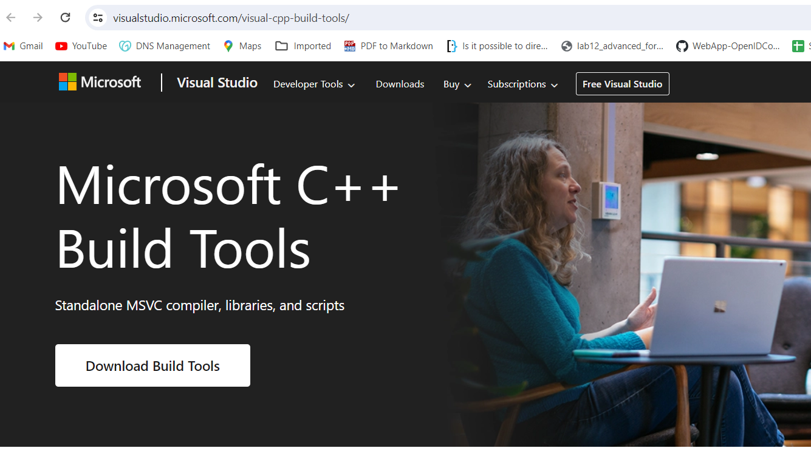

Lab: Intro to Dagster
---------------------

Dagster is an orchestrator that's designed for developing and maintaining data assets, such as tables, data sets, machine learning models, and reports.

In this lab, you'll analyze activity on the popular news aggregation website, Hacker News. You'll fetch data from the website, clean it up, and build a report that summarizes some findings. You'll then tell Dagster to occasionally update the data and the report, which Dagster calls assets.

#### Introduction to Software-defined assets

Before building a Dagster project, you'll first learn about Dagster's core concept: the Software-defined asset (SDA).

An asset is an object in persistent storage that captures some understanding of the world. Assets can be any type of object, such as:

- A database table or view
- A file, such as in your local machine or blob storage like Amazon S3
- A machine learning model

If you have an existing data pipeline, you likely already have assets.

`Software-defined` assets are a Dagster concept that allows you to write data pipelines in terms of the assets that they produce. How they work: you write code that describes an asset that you want to exist, along with any other assets that the asset is derived from, and a function that can be run to compute the contents of the asset.


### Getting set up

To complete this lab, you'll need:

- Python and pip. 

- To install Dagster. Run the following command from your terminal:

`pip install dagster`

- Go to following URL and download `Build Tools`

https://visualstudio.microsoft.com/visual-cpp-build-tools/



- Open cmd terminal where build tools exe has been downloaded and run folloiwng command: 

```
vs_buildtools.exe --norestart --passive --downloadThenInstall --includeRecommended --add Microsoft.VisualStudio.Workload.NativeDesktop --add Microsoft.VisualStudio.Workload.VCTools --add Microsoft.VisualStudio.Workload.MSBuildTools
```

**Creating your first Dagster project**

To verify that you successfully installed Dagster, let's create your first Dagster project! You'll use the Dagster scaffolding command to give you an empty Dagster project that you can run locally.

To create the project, run:

`dagster project from-example --example tutorial`

After running this command, you should see a new directory called tutorial in your current directory. This directory contains the files that make up your Dagster project. Next, you'll install the Python dependencies you'll be using during the tutorial.

```
cd tutorial
pip install -e ".[dev]"
```

This command also installs packages that aren't necessary for every Dagster project but are used for this tutorial. You don't have to read up on them, but if you're curious:

- **requests** will be used to download data from the internet
- **pandas** is a popular library for working with tabular data
- **matplotlib** makes it easy to make charts in Python
- **dagster_duckdb** manages how Dagster can read and write to DuckDB, an in-process data warehouse similar to SQLite, that you'll use for this tutorial
- **dagster_duckdb_pandas** allows loading data from DuckDB into Pandas DataFrames
- **Faker** is a library for generating fake data

The -e flag installs the project in editable mode, which means that most changes you make in your Dagster project will automatically be applied. The main exceptions are when you're adding new assets or installing additional dependencies.

To verify that it worked and that you can run Dagster locally, run:

`dagster dev`

Navigate to `localhost:3000`. You should see the Dagster UI. This command will run Dagster until you're ready to stop it. To stop the long-running process, press Control+C from the terminal that the process is running on.

