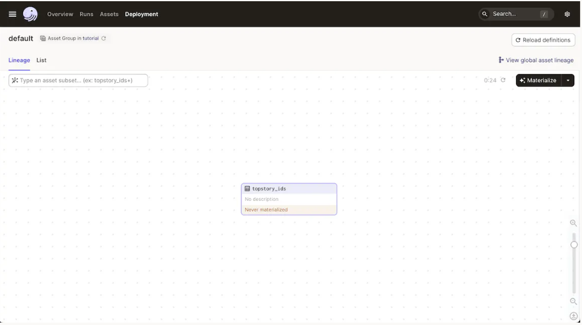
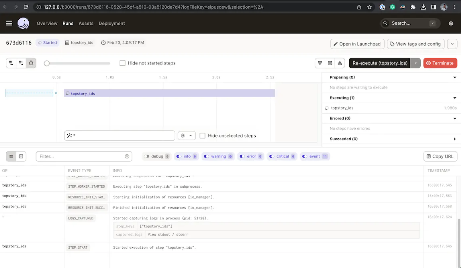

### Lab: Dagster - Writing your first asset

Now that you've installed Dagster and know what assets are, it's time for you to build parts of your first data pipeline!

In this lab, you'll analyze activity on a popular news aggregation website called Hacker News. This website features user-submitted stories about technology and startups. You will fetch data from the website, clean it up, and build a report summarizing your findings.

**Hacker News**: `https://news.ycombinator.com/`

By the end of this section, you will:

- Ingest data from the Hacker News API
- Turn that ingestion into an asset
- Explore the Dagster UI
- Launch your first Dagster run manually

**Step 1: Write your first asset**

In Dagster, the main way to create data pipelines is by writing assets. By the end of this tutorial section, you'll have written your first asset.

The scaffolded Dagster project has a directory called `tutorial`. If you named your project differently when running the Dagster CLI, the directory will be named after that.

The tutorial directory has a file named `assets.py`. This is where you'll put your first data pipeline.

**Ingesting data**

To get started, you will fetch data from the Hacker News API. Copy and paste the following code into `assets.py`:

```
import json
import os

import requests

newstories_url = "https://hacker-news.firebaseio.com/v0/topstories.json"
top_new_story_ids = requests.get(newstories_url).json()[:100]

os.makedirs("data", exist_ok=True)
with open("data/topstory_ids.json", "w") as f:
    json.dump(top_new_story_ids, f)
```

This code creates a list of integers representing the IDs for the current top stories on Hacker News and stores them in a file called `data/topstory_ids.json`.

Next, you will work towards making this code into a software-defined asset. The first step is turning it into a function:

```
import json
import os

import requests


def topstory_ids() -> None: # turn it into a function
    newstories_url = "https://hacker-news.firebaseio.com/v0/topstories.json"
    top_new_story_ids = requests.get(newstories_url).json()[:100]

    os.makedirs("data", exist_ok=True)
    with open("data/topstory_ids.json", "w") as f:
        json.dump(top_new_story_ids, f)
```

Now, add the `@asset` decorator from the dagster library to the function:

```
import json
import os

import requests
from dagster import asset # import the `dagster` library

@asset # add the asset decorator to tell Dagster this is an asset
def topstory_ids() -> None:
    newstories_url = "https://hacker-news.firebaseio.com/v0/topstories.json"
    top_new_story_ids = requests.get(newstories_url).json()[:100]

    os.makedirs("data", exist_ok=True)
    with open("data/topstory_ids.json", "w") as f:
        json.dump(top_new_story_ids, f)
```

That's all it takes to get started 🎉. Dagster now knows that this is an asset. In future sections, you'll see how you can add metadata, schedule when to refresh the asset, and more.

And now you're done! Time to go into the Dagster UI and see what you've built.

### Exploring the Dagster UI

Using Dagster's UI, you can explore your data assets, manually launch runs, and observe what's happening during pipeline runs.

As a reminder, to launch the UI, set your terminal's current directory to /tutorial and run the following command:

`dagster dev`

Navigate to `localhost:3000` in your browser to see the Dagster UI.

You should see a screen that looks similar to below. If you do not see it, go the top navigation bar, click on **Assets**, then go the top-right region and click on **View global asset lineage**. You can also navigate directly to this page by going to `localhost:3000/asset-groups`. As more assets are built, this graph will show your entire data platform in one place. This page can also be referred to as the Global Asset Lineage.



Observe that Dagster has detected your topstory_ids asset, but it says that the asset has never been "materialized".

#### Step 2: Materialize your asset

To materialize a Software-defined asset means to create or update it. Dagster materializes assets by executing the asset's function or triggering an integration.

To manually materialize an asset in the UI, click the **Materialize** button in the upper right corner of the screen. This will create a Dagster run that will materialize your assets.

To follow the progress of the materialization and monitor the logs, each run has a dedicated page. To find the page:

1. Click on the **Runs** tab in the upper navigation bar
2. Click the value in the **Run ID** column on the table of the Runs page
3. The top section displays the progress, and the bottom section live updates with the logs



#### Next steps

You've written the first step in your data pipeline! In the next section, you'll learn how to add more assets to your pipeline. You'll also learn how to add information and metadata to your assets.