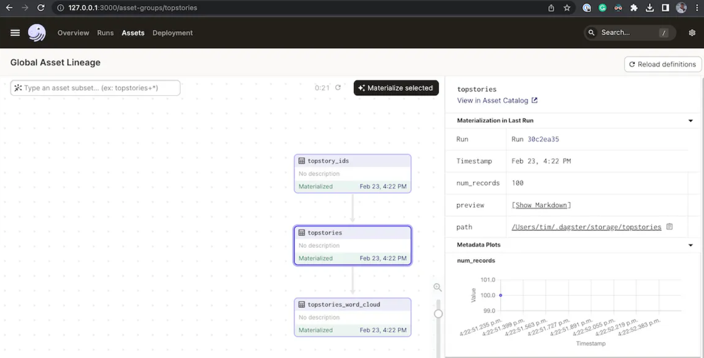
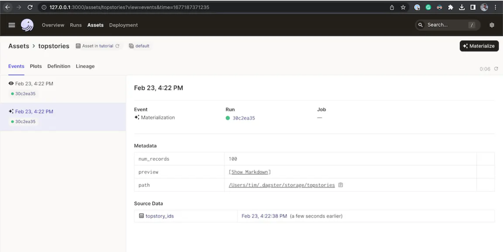
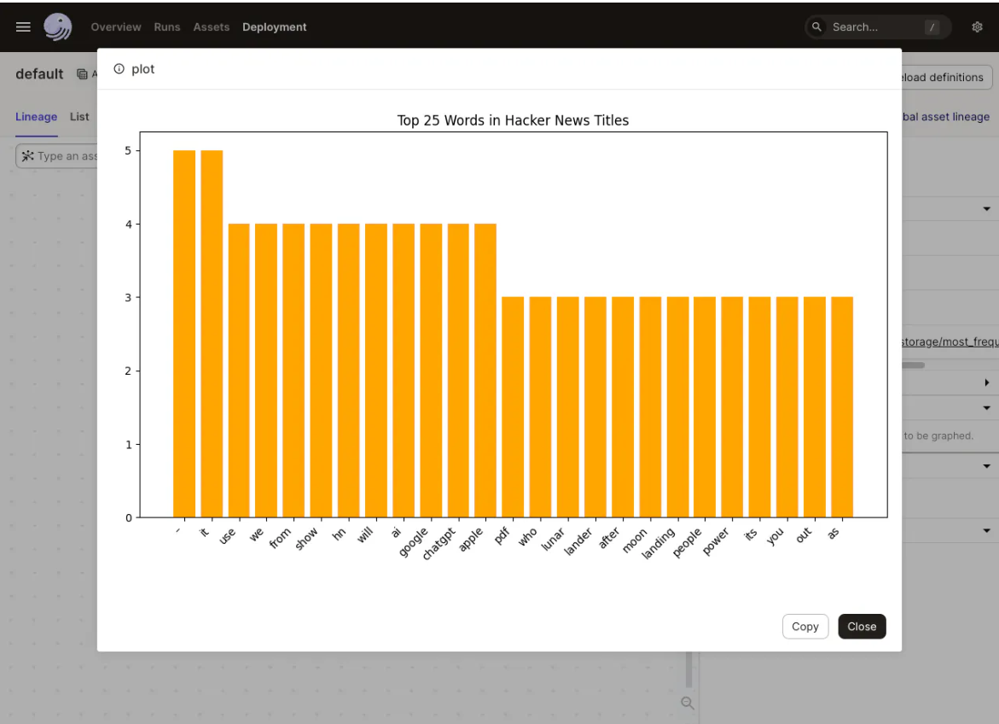

### Lab: Dagster - Building an asset graph

In the previous portion of the tutorial, you wrote your first Software-defined asset (SDA), looked at Dagster's UI, and manually materialized your asset.

Continuing from there, you will:

- Add more assets to your Dagster project
- Connect them to finish creating the pipeline
- Give users more knowledge about the assets by adding metadata and logging

**Step 1: Adding the DataFrame asset**

Using the top Hacker News story IDs, you'll now look up each story by its ID, ingest that data, and make a DataFrame out of it. You'll connect your current asset with this new asset to establish dependencies and make an asset graph.

Modify your `assets.py` to add the pandas import and a new asset called `topstories`:

Add new imports, such as `import pandas as pd`, to the top of `assets.py`

```
import json
import os

import pandas as pd  # Add new imports to the top of `assets.py`
import requests

from dagster import asset

# ... Keep the `topstory_ids` asset from the previous section


@asset(deps=[topstory_ids])  # this asset is dependent on topstory_ids
def topstories() -> None:
    with open("data/topstory_ids.json", "r") as f:
        topstory_ids = json.load(f)

    results = []
    for item_id in topstory_ids:
        item = requests.get(
            f"https://hacker-news.firebaseio.com/v0/item/{item_id}.json"
        ).json()
        results.append(item)

        if len(results) % 20 == 0:
            print(f"Got {len(results)} items so far.")

    df = pd.DataFrame(results)
    df.to_csv("data/topstories.csv")
```

Dependencies between assets are defined using the deps parameter of the @asset decorator. In this case, `topstory_ids` (the list of IDs) is a dependency of topstories (the CSV file).

In your browser, navigate back to Dagster's Global Asset Lineage (`localhost:3000/asset-groups`), and click on the **Reload Definitions** button on the top-right region of the page. This will tell Dagster to re-scan your code for new assets and other definitions without stopping Dagster. You can also use the Command + Option + R (Mac) or Control + Alt (Windows) + R keyboard shortcut to perform the same action.

After reloading your definitions, look at the asset graph to see the relationship between your assets.

#### Logging during asset materialization

In the code above, a print statement is used to show progress while fetching stories from the Hacker News API. Dagster has a built-in logger that extends past print and other Python logging methods. This logger shows exactly where logging happens in your Dagster project, such as which asset and step during a run the log came from.

Dagster's logger can be accessed through the context argument, which is available through any asset-decorated function if the first keyword argument in it is named context. The context argument contains the logger, information about the current run, and other Dagster-specific utilities.

The Dagster framework uses Python type hints, such as how the context argument is of type **AssetExecutionContext**. By annotating the context argument, most code editors will enable autocomplete for the methods available on the context object, such as context.log.info.

The code below replaces the print statement with the Dagster logger:

```
from dagster import asset, AssetExecutionContext


@asset(deps=[topstory_ids])
def topstories(context: AssetExecutionContext) -> None:
    with open("data/topstory_ids.json", "r") as f:
        topstory_ids = json.load(f)

    results = []
    for item_id in topstory_ids:
        item = requests.get(
            f"https://hacker-news.firebaseio.com/v0/item/{item_id}.json"
        ).json()
        results.append(item)

        if len(results) % 20 == 0:
            context.log.info(f"Got {len(results)} items so far.")

    df = pd.DataFrame(results)
    df.to_csv("data/topstories.csv")
```

**Step 2: Creating an unstructured data asset**

Along with structured data like tables, Dagster's assets can also be unstructured data, such as JSON files or images. Your next and final asset will take the DataFrame of stories and create a dictionary of the most frequent words in the titles.

Below is the finished code for a `most_frequent_words` asset. Copy and paste the code into assets.py:

```
@asset(deps=[topstories])
def most_frequent_words() -> None:
    stopwords = ["a", "the", "an", "of", "to", "in", "for", "and", "with", "on", "is"]

    topstories = pd.read_csv("data/topstories.csv")

    # loop through the titles and count the frequency of each word
    word_counts = {}
    for raw_title in topstories["title"]:
        title = raw_title.lower()
        for word in title.split():
            cleaned_word = word.strip(".,-!?:;()[]'\"-")
            if cleaned_word not in stopwords and len(cleaned_word) > 0:
                word_counts[cleaned_word] = word_counts.get(cleaned_word, 0) + 1

    # Get the top 25 most frequent words
    top_words = {
        pair[0]: pair[1]
        for pair in sorted(word_counts.items(), key=lambda x: x[1], reverse=True)[:25]
    }

    with open("data/most_frequent_words.json", "w") as f:
        json.dump(top_words, f)
```

**Step 3: Educating users with metadata**

Up until now, you've annotated your asset functions with None, meaning the asset doesn't return anything. In this section, you'll learn about the **MaterializeResult** object, which lets you record metadata about your asset.

Software-defined Assets can be enriched with different types of metadata. Anything can be used as metadata for an asset. Common details to add are:

- Statistics about the data, such as row counts or other data profiling
- Test results or assertions about the data
- Images or tabular previews of the asset
- Information about who owns the asset, where it's stored, and links to external documentation

The following code adds a row count and a preview of the topstories asset. Update your code for the topstories asset to match the changes below. The None type annotation is replaced with **MaterializeResult** from the `dagster` module, which allows you to add metadata to the materialization of your asset.

```
import base64
from io import BytesIO

import matplotlib.pyplot as plt

from dagster import AssetExecutionContext, MetadataValue, asset, MaterializeResult

# Add the imports above to the top of `assets.py`


@asset(deps=[topstory_ids])
def topstories(context: AssetExecutionContext) -> MaterializeResult:
    with open("data/topstory_ids.json", "r") as f:
        topstory_ids = json.load(f)

    results = []
    for item_id in topstory_ids:
        item = requests.get(
            f"https://hacker-news.firebaseio.com/v0/item/{item_id}.json"
        ).json()
        results.append(item)

        if len(results) % 20 == 0:
            context.log.info(f"Got {len(results)} items so far.")

    df = pd.DataFrame(results)
    df.to_csv("data/topstories.csv")

    return MaterializeResult(
        metadata={
            "num_records": len(df),  # Metadata can be any key-value pair
            "preview": MetadataValue.md(df.head().to_markdown()),
            # The `MetadataValue` class has useful static methods to build Metadata
        }
    )
```

Reload the definitions and re-materialize your assets. The metadata can then be seen in the following places:

- In the **Asset graph** page, click on an asset and its metadata will be shown in the right sidebar:



In the **Asset Catalog's** page for the `topstories` asset:



#### Metadata and Markdown

The DataFrame was embedded into the asset's metadata with Markdown. Any valid Markdown snippet can be stored and rendered in the Dagster UI, including images. By embedding a bar chart of the most frequently used words as metadata, you and your team can visualize and analyze the most_frequent_words asset without leaving the Dagster UI.

Below is code that changes shows how to add an an image of a bar chart in asset metadata. Replace your `most_frequent_words` asset with the following:

```
@asset(deps=[topstories])
def most_frequent_words() -> MaterializeResult:
    stopwords = ["a", "the", "an", "of", "to", "in", "for", "and", "with", "on", "is"]

    topstories = pd.read_csv("data/topstories.csv")

    # loop through the titles and count the frequency of each word
    word_counts = {}
    for raw_title in topstories["title"]:
        title = raw_title.lower()
        for word in title.split():
            cleaned_word = word.strip(".,-!?:;()[]'\"-")
            if cleaned_word not in stopwords and len(cleaned_word) > 0:
                word_counts[cleaned_word] = word_counts.get(cleaned_word, 0) + 1

    # Get the top 25 most frequent words
    top_words = {
        pair[0]: pair[1]
        for pair in sorted(word_counts.items(), key=lambda x: x[1], reverse=True)[:25]
    }

    # Make a bar chart of the top 25 words
    plt.figure(figsize=(10, 6))
    plt.bar(list(top_words.keys()), list(top_words.values()))
    plt.xticks(rotation=45, ha="right")
    plt.title("Top 25 Words in Hacker News Titles")
    plt.tight_layout()

    # Convert the image to a saveable format
    buffer = BytesIO()
    plt.savefig(buffer, format="png")
    image_data = base64.b64encode(buffer.getvalue())

    # Convert the image to Markdown to preview it within Dagster
    md_content = f"})"

    with open("data/most_frequent_words.json", "w") as f:
        json.dump(top_words, f)

    # Attach the Markdown content as metadata to the asset
    return MaterializeResult(metadata={"plot": MetadataValue.md(md_content)})
```

Reload your definitions and rematerialize your assets. The bar chart will be visible with the rest of your materialization metadata for the `most_frequent_words` asset. The path key in the metadata will contain a link that says **[Show Markdown]**. Clicking on the link will open the preview in the Dagster UI. The bar chart will change throughout the day as the top stories change. Here's an example of what `most_frequent_words` looked like at the time we wrote this tutorial:



If your data is sensitive, such as PHI or PII, be careful and follow your organization's policies for surfacing data. You should practice due diligence before showing your data in metadata or logs.

**Next steps**

By now, you've:

- Written and materialized three assets
- Previewed the data in Dagster's UI
- Empowered stakeholders and your future self with metadata and logging