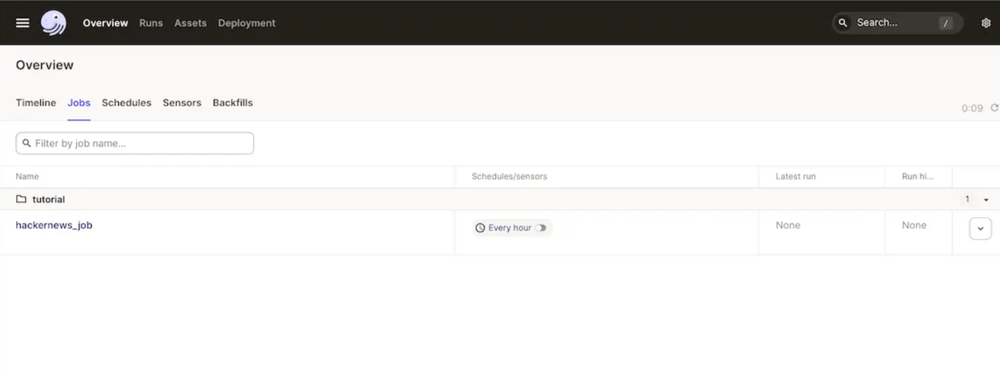
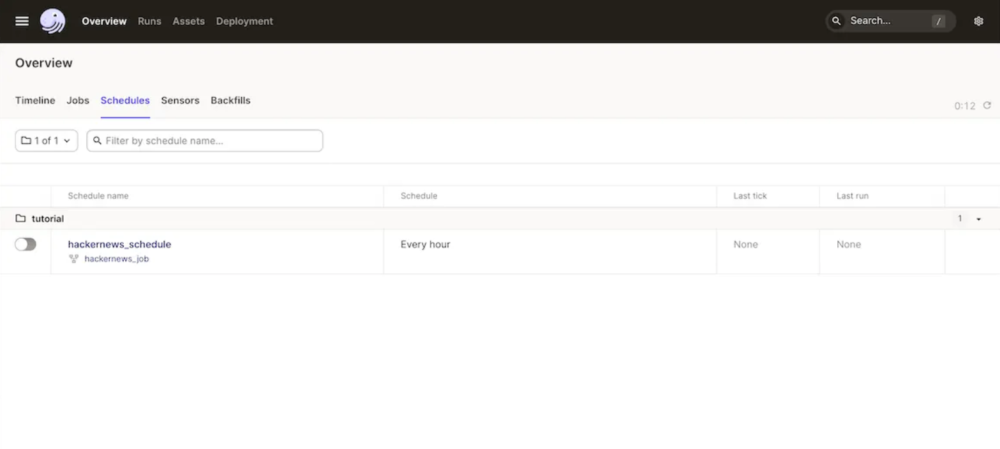
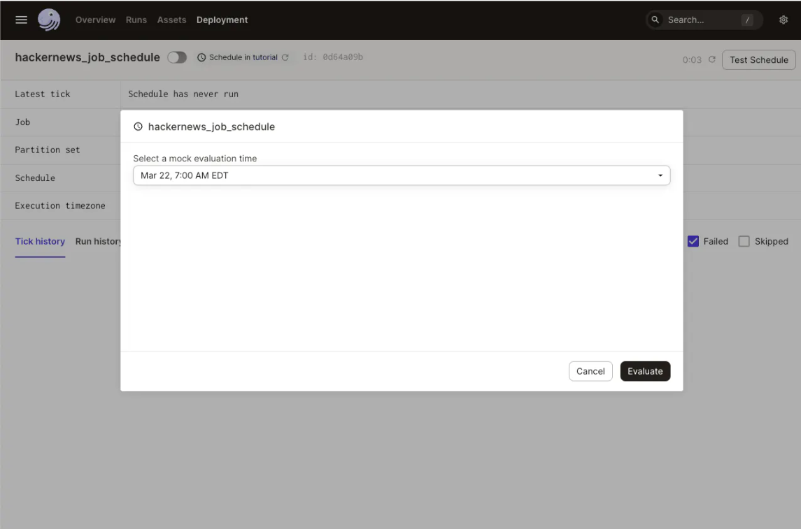

### Lab: Dagster - Scheduling your pipeline

Now that you've written an entire pipeline in Dagster, you will need to run it regularly to keep your assets up to date.

By the end of this part of the tutorial, you'll be able to:

- Structure your project with code locations and jobs
- Refresh your assets periodically with schedules

**Step 1: Defining what assets to update**

A job lets you target a selection of assets to materialize them together as a single action. Assets can belong to multiple jobs.

Your Dagster repository has a file called `tutorial/__init__.py` that is used as a top-level definition for your project. Update the code in this file to add the job using the **define_asset_job** function:

```
from dagster import (
    AssetSelection,
    Definitions,
    define_asset_job,
    load_assets_from_modules,
)

from . import assets

all_assets = load_assets_from_modules([assets])

# Addition: define a job that will materialize the assets
hackernews_job = define_asset_job("hackernews_job", selection=AssetSelection.all())

defs = Definitions(
    assets=all_assets,
    jobs=[hackernews_job],  # Addition: add the job to Definitions object (see below)
)
```

Dagster's **AssetSelection** module lets you choose which assets to attach to a job. In the example above, **AssetSelection.all** selects all assets.

Once you have a job, you can execute it on a schedule, by clicking a button in the Dagster UI, the CLI, or via Dagster's GraphQL endpoints. Confirm that your job was defined by:

1. Going to the UI
2. Reloading your project through the **Reload Definitions** button in the asset graph or on the **Deployments** page
3. Navigating to **Overview > Jobs**
4. Clicking on the job
5. Seeing your assets selected for the job the Dagster UI with a job



**About definitions**

Up until this point, you defined assets using the `@asset` decorator. Dagster definitions are entities that Dagster learns about by importing your code. Just now, you used a different kind of definition: a job definition.

Managing one type of definition, such as assets, is easy. However, it can quickly become unruly as your project grows to have a variety of definitions (ex. schedules, jobs, sensors). To combine definitions and have them aware of each other, Dagster provides a utility called the `Definitions` object.

**Step 2: Scheduling the materializations**

After defining a job, it can be attached to a schedule. A schedule's responsibility is to start a run of the assigned job at a specified time. Schedules are added with the ScheduleDefinition class.

To regularly update the assets, add the new ScheduleDefinition import, create a new schedule for the hackernews_job, and add the schedule to the code location. The code below is how your `__init__.py` should look after making these changes:

```
from dagster import (
    AssetSelection,
    Definitions,
    ScheduleDefinition,
    define_asset_job,
    load_assets_from_modules,
)

from . import assets

all_assets = load_assets_from_modules([assets])

# Define a job that will materialize the assets
hackernews_job = define_asset_job("hackernews_job", selection=AssetSelection.all())

# Addition: a ScheduleDefinition the job it should run and a cron schedule of how frequently to run it
hackernews_schedule = ScheduleDefinition(
    job=hackernews_job,
    cron_schedule="0 * * * *",  # every hour
)

defs = Definitions(
    assets=all_assets,
    schedules=[hackernews_schedule],
)
```

Go to the UI, click **Overview > Schedules** tab, and observe your new schedule with the attached job.



To test the change, click the schedule's name to view its details. Click the **Test Schedule** button on the top right corner of the page to trigger the schedule immediately.



#### Next steps

By now, you've:

- Grouped your objects with a code location
- Defined a sequence of materializations with a job
- Run the job on a schedule

In the next section, you'll learn how to build more robustness, reusability, and flexibility when connecting to external services by using resources.