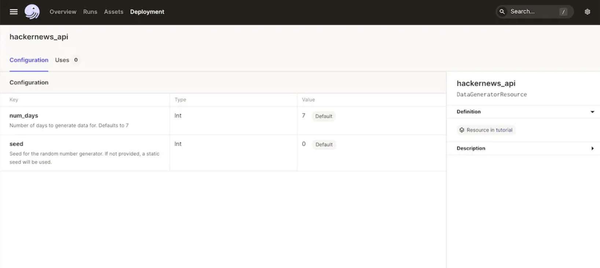
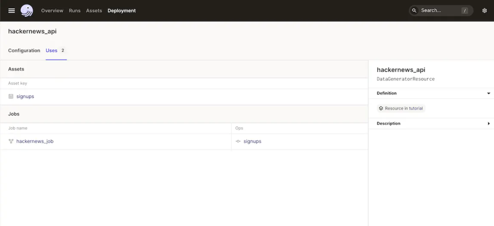

### Lab: Dagster - Connecting to external services

Throughout the dagster labs, you built a data pipeline that connects to different external services, such as Hacker News. By building this asset graph, Dagster acts as a control plane of multiple different external services. However, connecting to these services and managing their use can be difficult. Resources are the recommended way to manage these connections in Dagster.

Resources are Dagster objects that connect to external services, such as Slack, Snowflake, or Amazon S3. In this section, you’ll learn more about resources, including how to:

- Define a resource and use it in an asset
- Configure a resource
- Customize a resource based on the environment where Dagster is running

### Why use resources?

In the `topstory_ids` and `topstories` assets, you used the `requests` library to communicate with the Hacker News API. This code gets harder to maintain if:

- Connections need to be shared across multiple assets
- You need to authenticate with an external service securely
- Configurations need to be consistent across its usage

Aside from the complexity of configuring them, building a data pipeline creates many connections to external services. It becomes difficult to understand what assets use which connections or how often a connection is used.

You should use resources to manage communicating with external services because they:

- Enable flexibility in configuration
- Standardize how connections are used across assets
- Create a single source to monitor connections in the Dagster UI

**Step 1: Setting up a resource**

Suppose your Hacker News pipeline in Dagster has picked up momentum, and your stakeholders want to learn more about who is using it. You are tasked with analyzing how many people sign up for Hacker News.

In the scaffolded Dagster project you made in Part 2 of the tutorial, you may have noticed a directory called **resources** with an `__init__.py` file in it. It exposes a resource called DataGeneratorResource. This resource generates simulated data about Hacker News signups. You'll use this resource to get the data needed to produce an asset for analysis.

The signup data from Hacker News is fake and generated by the library. This is simulated data and should not be used for real use cases.
In your `__init__.py`, import the class, create an instance of it, and add it to the resources argument for your code location's **Definitions** object under the key hackernews_api. The key used to define a resource in the **Definitions** object is the key you'll use to reference the resource later in your code. In this case, we’ll call it hackernews_api.

Verify that your code looks similar to the code below:

```
from .resources import DataGeneratorResource

# ...

datagen = DataGeneratorResource()  # Make the resource

defs = Definitions(
    assets=all_assets,
    schedules=[hackernews_schedule],
    resources={
        "hackernews_api": datagen,  # Add the newly-made resource here
    },
)
```

To confirm that this worked:

1. Go into the Dagster UI
2. Reload your definitions
3. Navigate to the **Overview** page
4. Go to the **Resources** tab
5. Find the `hackernews_api` resource in the tab and click on it
6. Observe the details of the resource




**Step 2: Using the resource**

On this page, you might notice that the Uses value for the `hackernews_api` resource is `0`. This is because you've defined the resource but have yet to use it.

In your `assets.py`, make a new asset called signups. In this asset, you'll use your newly made resource to fetch data from a simulated external service and save the signups.

Copy and paste the code below into the appropriate sections of your `asset.py`.

```
from .resources import DataGeneratorResource

# ...


@asset
def signups(hackernews_api: DataGeneratorResource) -> MaterializeResult:
    signups = pd.DataFrame(hackernews_api.get_signups())

    signups.to_csv("data/signups.csv")

    return MaterializeResult(
        metadata={
            "Record Count": len(signups),
            "Preview": MetadataValue.md(signups.head().to_markdown()),
            "Earliest Signup": signups["registered_at"].min(),
            "Latest Signup": signups["registered_at"].max(),
        }
    )
```

Verify this new asset works by reloading your definitions and materializing the signups asset. If you navigate to the `hackernews_api's` resource page from earlier, you’ll notice its Uses value now says 2: one for the asset using it and another for the job using this asset. Click on the number and ensure that your signups asset uses the `hackernews_api` resource.




**Step 3: Configuring the resource**

Looking at the resulting `signups` asset, you’ll see that it only contains the number of signups from the past week. This happened because the library only fetches the last seven days of data by default.

Resources can take arguments to configure them. However, this resource lets you define how many days of data should be fetched. Let’s say you want to get a year’s worth of data. Update your instantiation of the **DataGeneratorResource** to match the change below:

```
datagen = DataGeneratorResource(num_days=365)

defs = Definitions(
    # ...
    resources={"hackernews_api": datagen}
)
```

Confirm this worked by materializing the signups asset again. The Earliest Signup date should be a year ago from the Latest Signup date.


**Configuring based on the environment**

Imagine that you've deployed this new asset to your production Dagster instance. As you're tinkering around in development, you start thinking that you don't need a year's worth of data during local development. By fetching all signups in the past year, materializing the asset is slow and takes up a lot of storage on your computer. However, your stakeholders still need a whole year's worth of data.

Using **environment variables**, you can configure how the **DataGeneratorResource** behaves based on the environment where Dagster is running. In development, you can fetch only the past 30 days of data for a rapid feedback loop. For production, you can get the full year of data needed.

To do this, you should set an environment variable that Dagster can use to configure the resource.

In your **Dagster** project, there should be a file called `.env.example` in it with one line of code:

`HACKERNEWS_NUM_DAYS_WINDOW=30`

Rename this file from `.env.example` to `.env`.

Afterward, you'll use Dagster's EnvVar class to access the environment variable. Update your `__init__.py` with the changes below:

```
from dagster import (
    # .. your existing imports go here
    EnvVar,
)

# ... the existing portion of your `__init__.py` goes here.

# Configure the resource with an environment variable here
datagen = DataGeneratorResource(
    num_days=EnvVar.int("HACKERNEWS_NUM_DAYS_WINDOW"),
)

defs = Definitions(
    # ...
    resources={"hackernews_api": datagen}
)
```

Restart your Dagster instance, materialize your signups asset, and observe how the Earliest Signup metadata value is 30 days ago from today.