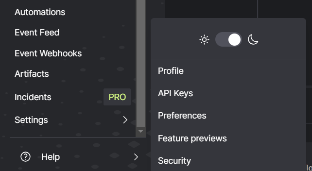
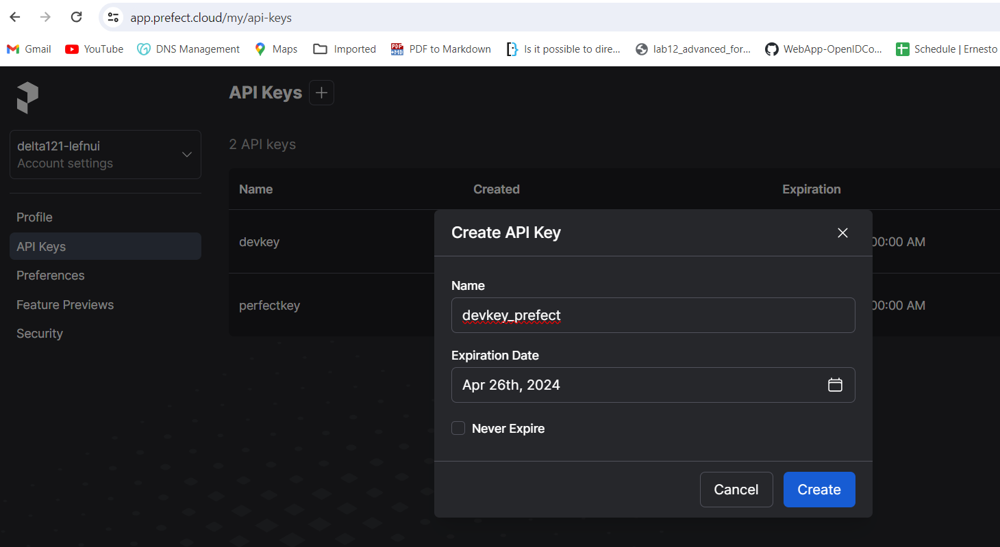
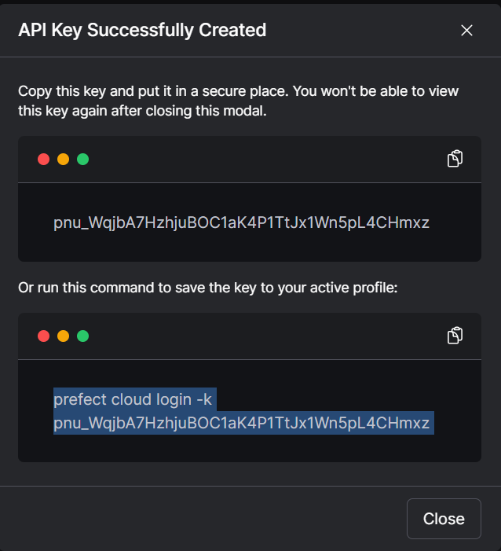
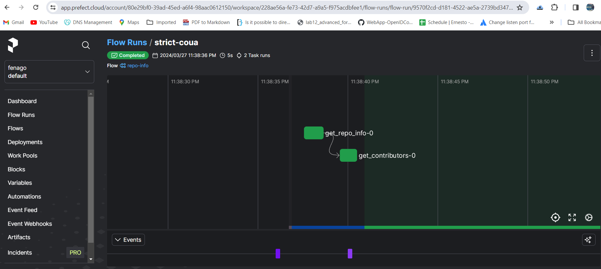
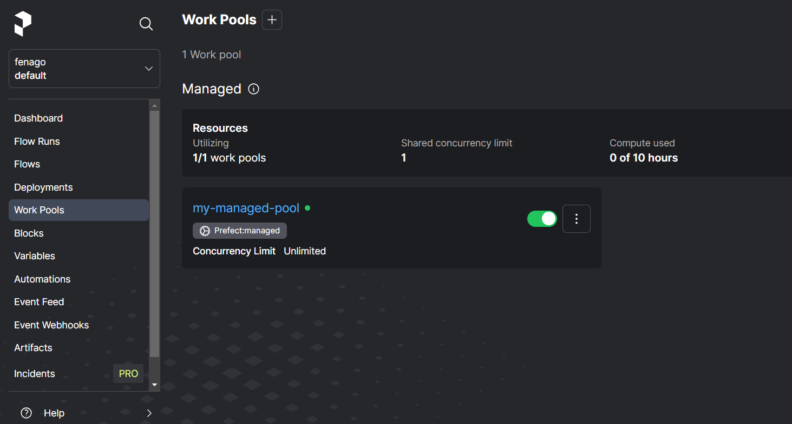
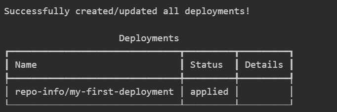
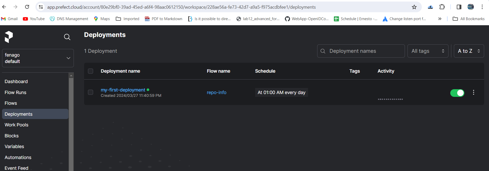

## Lab: Prefect 

Prefect is an orchestration and observability platform that empowers developers to build and scale resilient code quickly, turning their Python scripts into resilient, recurring workflows.

In this lab, you'll see how you can schedule your code on remote infrastructure and observe the state of your workflows. With Prefect, you can go from a Python script to a production-ready workflow that runs remotely in a few minutes.

Let's get started!

### Setup

Here's a basic script that fetches statistics about the main Prefect GitHub repository.

```
import httpx

def get_repo_info():
    url = "https://api.github.com/repos/PrefectHQ/prefect"
    response = httpx.get(url)
    repo = response.json()
    print("PrefectHQ/prefect repository statistics 🤓:")
    print(f"Stars 🌠 : {repo['stargazers_count']}")

if __name__ == "__main__":
    get_repo_info()
```

How can we make this script schedulable, observable, resilient, and capable of running anywhere?

#### Step 1: Install Prefect

Prefect is published as a Python package. To install or upgrade an existing Prefect install, run the following command in your terminal:

`pip install -U "prefect==2.16.6"`


#### Step 2: Connect to Prefect's API

Much of Prefect's functionality is backed by an API. Sign up for a forever free Prefect Cloud account or accept your organization's invite to join their Prefect Cloud account.

1. Create a new account or sign in at https://app.prefect.cloud/.

2. Create `API Key` from prefect cloud:







3. Use the `prefect cloud login` CLI command to log in to Prefect Cloud from your environment.

`prefect cloud login -k UPDATE_KEY_HERE `


#### Step 3: Turn your function into a Prefect flow

The fastest way to get started with Prefect is to add a @flow decorator to your Python function. Flows are the core observable, deployable units in Prefect and are the primary entrypoint to orchestrated work.

Create a python file `my_gh_workflow.py`:

```
import httpx   # an HTTP client library and dependency of Prefect
from prefect import flow, task


@task(retries=2)
def get_repo_info(repo_owner: str, repo_name: str):
    """Get info about a repo - will retry twice after failing"""
    url = f"https://api.github.com/repos/{repo_owner}/{repo_name}"
    api_response = httpx.get(url)
    api_response.raise_for_status()
    repo_info = api_response.json()
    return repo_info


@task
def get_contributors(repo_info: dict):
    """Get contributors for a repo"""
    contributors_url = repo_info["contributors_url"]
    response = httpx.get(contributors_url)
    response.raise_for_status()
    contributors = response.json()
    return contributors


@flow(log_prints=True)
def repo_info(repo_owner: str = "PrefectHQ", repo_name: str = "prefect"):
    """
    Given a GitHub repository, logs the number of stargazers
    and contributors for that repo.
    """
    repo_info = get_repo_info(repo_owner, repo_name)
    print(f"Stars 🌠 : {repo_info['stargazers_count']}")

    contributors = get_contributors(repo_info)
    print(f"Number of contributors 👷: {len(contributors)}")


if __name__ == "__main__":
    repo_info()
```

Note that we added a log_prints=True argument to the @flow decorator so that print statements within the flow-decorated function will be logged. Also note that our flow calls two tasks, which are defined by the @task decorator. Tasks are the smallest unit of observed and orchestrated work in Prefect.

`python my_gh_workflow.py`

Now when we run this script, Prefect will automatically track the state of the flow run and log the output where we can see it in the UI and CLI.

```
14:28:31.099 | INFO    | prefect.engine - Created flow run 'energetic-panther' for flow 'repo-info'
14:28:31.100 | INFO    | Flow run 'energetic-panther' - View at https://app.prefect.cloud/account/123/workspace/abc/flow-runs/flow-run/xyz
14:28:32.178 | INFO    | Flow run 'energetic-panther' - Created task run 'get_repo_info-0' for task 'get_repo_info'
14:28:32.179 | INFO    | Flow run 'energetic-panther' - Executing 'get_repo_info-0' immediately...
14:28:32.584 | INFO    | Task run 'get_repo_info-0' - Finished in state Completed()
14:28:32.599 | INFO    | Flow run 'energetic-panther' - Stars 🌠 : 13609
14:28:32.682 | INFO    | Flow run 'energetic-panther' - Created task run 'get_contributors-0' for task 'get_contributors'
14:28:32.682 | INFO    | Flow run 'energetic-panther' - Executing 'get_contributors-0' immediately...
14:28:33.118 | INFO    | Task run 'get_contributors-0' - Finished in state Completed()
14:28:33.134 | INFO    | Flow run 'energetic-panther' - Number of contributors 👷: 30
14:28:33.255 | INFO    | Flow run 'energetic-panther' - Finished in state Completed('All states completed.')
```

You should see similar output in your terminal, with your own randomly generated flow run name and your own Prefect Cloud account URL.



#### Step 4: Choose a remote infrastructure location

Let's get this workflow running on infrastructure other than your local machine! We can tell Prefect where we want to run our workflow by creating a `work pool`.

We can have Prefect Cloud run our flow code for us with a Prefect Managed work pool.

Let's create a `Prefect Managed work pool` so that Prefect can run our flows for us. We can create a work pool in the UI or from the CLI. Let's use the CLI:

`prefect work-pool create my-managed-pool --type prefect:managed`

You should see a message in the CLI that your work pool was created. Feel free to check out your new work pool on the **Work Pools** page in the UI.



#### Step 5: Make your code schedulable

We have a flow function and we have a work pool where we can run our flow remotely. Let's package both of these things, along with the location for where to find our flow code, into a **deployment** so that we can schedule our workflow to run remotely.

Deployments elevate flows to remotely configurable entities that have their own API.

Let's make a script to build a deployment with the name my-first-deployment and set it to run on a schedule.

Create a python file `create_deployment.py`:

```
from prefect import flow

if __name__ == "__main__":
    flow.from_source(
        source="https://github.com/discdiver/demos.git",
        entrypoint="my_gh_workflow.py:repo_info",
    ).deploy(
        name="my-first-deployment",
        work_pool_name="my-managed-pool",
        cron="0 1 * * *",
    )
```

Run the script to create the deployment on the Prefect Cloud server. Note that the cron argument will schedule the deployment to run at 1am every day.


`python create_deployment.py`

You should see a message that your deployment was created, similar to the one below.



Head to the Deployments page of the UI to check it out.



#### Remove the schedule

Click the Remove button in the top right of the Deployment page so that the workflow is no longer scheduled to run once per day.