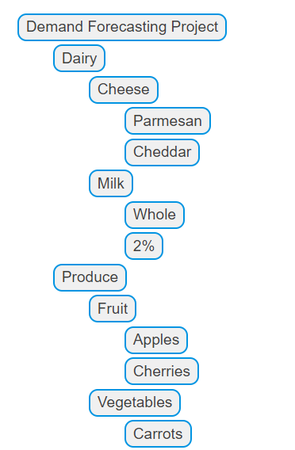

Lab 2: MLFlow
-------------

In this lab, we’ll be covering the essential basics of core MLflow functionality associated with tracking training event data.

We’ll start by learning how to start a local MLflow Tracking server, how to access and view the MLflow UI, and move on to our first interactions with the Tracking server through the use of the MLflow Client.

The lab content builds upon itself, culminating in successfully logging your first MLflow model.

The topics in this lab cover:

- Starting an MLflow Tracking Server (Optionally) and connecting to a Tracking Server
- Exploring the MlflowClient API (briefly)
- Understanding the Default Experiment
- Searching for Experiments with the MLflow client API
- Understanding the uses of tags and how to leverage them for model organization
- Creating an Experiment that will contain our run (and our model)
- Learning how to log metrics, parameters, and a model artifact to a run
- Viewing our Experiment and our first run within the MLflow UI


Lab Solution
-------------

Complete solution for this lab is available in the `lab2_logging_model.ipynb` notebook.


Starting the MLflow Tracking Server
====================================

Before diving into MLflow's rich features, let's set up the foundational
components: the MLflow Tracking Server and the MLflow UI. This guide
will walk you through the steps to get both up and running.


Setting Up MLflow
-------------------

The first thing that we need to do is to get MLflow.


Step 1: Install MLflow from PyPI
---------------------------------

Make sure mlflow has been installed using PIP.


Step 2: Launch the MLflow Tracking Server
----------------------------------------

To begin, you'll need to initiate the MLflow Tracking Server. Remember
to keep the command prompt running during the lab, as closing it
will shut down the server.


`mlflow server --host 127.0.0.1 --port 8080`

Once the server starts running, you should see the following output:


```
[2023-11-01 10:28:12 +0900] [28550] [INFO] Starting gunicorn 20.1.0
[2023-11-01 10:28:12 +0900] [28550] [INFO] Listening at: http://127.0.0.1:8080 (28550)
[2023-11-01 10:28:12 +0900] [28550] [INFO] Using worker: sync
[2023-11-01 10:28:12 +0900] [28552] [INFO] Booting worker with pid: 28552
[2023-11-01 10:28:12 +0900] [28553] [INFO] Booting worker with pid: 28553
[2023-11-01 10:28:12 +0900] [28555] [INFO] Booting worker with pid: 28555
[2023-11-01 10:28:12 +0900] [28558] [INFO] Booting worker with pid: 28558
...
```

Note: Remember the host and port name that your MLflow tracking server is
assigned. 


Your MLflow environment is now set up and ready to go.
As you progress, you'll explore the myriad of functionalities MLflow has
to offer, streamlining and enhancing your machine learning workflows.


Using the MLflow Client API
===========================

In the previous section, we started an instance of the MLflow Tracking Server and the MLflow UI. For this stage, we’re going to be interfacing with the Tracking Server through one of the primary mechanisms that you will use when training ML models, the MlflowClient. For the duration of this lab, this client API will be your primary interface for MLflow’s tracking capabilities, enabling you to:

- Initiate a new Experiment.
- Start Runs within an Experiment.
- Document parameters, metrics, and tags for your Runs.
- Log artifacts linked to runs, such as models, tables, plots, and more.


Importing Dependencies
-----------------------

In order to use the MLflowClient API, the initial step involves
importing the necessary modules.


- Python


```
from mlflow import MlflowClient
from pprint import pprint
from sklearn.ensemble import RandomForestRegressor
```

With these modules imported, you're now prepared to configure the client
and relay specifics about the location of your tracking server.


Configuring the MLflow Tracking Client
--------------------------------------


By default, barring any modifications to the
`MLFLOW_TRACKING_URI` environment
variable, initializing the MlflowClient will designate your local
storage as the tracking server. This means your experiments, data,
models, and related attributes will be stored within the active
execution directory.

For the context of this guide, we'll utilize the tracking server
initialized earlier in the documentation, instead of using the client to
log to the local file system directory.

In order to connect to the tracking server that we created in the
previous section of this lab, we'll need to use the uri that we
assigned the server when we started it. The two components that we
submitted as arguments to the `mlflow server` command were the `host`
and the `port`. Combined, these form
the `tracking_uri` argument that we
will specify to start an instance of the client.


- Python


```
client = MlflowClient(tracking_uri="http://127.0.0.1:8080")
```

We now have a client interface to the tracking server that can both send
data to and retrieve data from the tracking server.


The Default Experiment
-----------------------

Before we get to logging anything to the Tracking Server, let's take a
look at a key feature that exists at the outset of starting any MLflow
Tracking Server: the Default Experiment.

The Default Experiment is a placeholder that is used to encapsulate all
run information if an explicit Experiment is not declared. While using
MLflow, you'll be creating new experiments in order to organize
projects, project iterations, or logically group large modeling
activities together in a grouped hierarchical collection. However, if
you manage to forget to create a new Experiment before using the MLflow
tracking capabilities, the Default Experiment is a fallback for you to
ensure that your valuable tracking data is not lost when executing a
run.

Let's see what this Default Experiment looks like by using the `mlflow.client.MlflowClient.search_experiments()` API.


Searching Experiments
----------------------

The first thing that we're going to do is to view the metadata
associated with the Experiments that are on the server. We can
accomplish this through the use of the
`mlflow.client.MlflowClient.search_experiments()` API. Let's issue a search query to see what the results are.


- Python


```
all_experiments = client.search_experiments()

print(all_experiments)
```


```
[<Experiment: artifact_location='./mlruns/0', creation_time=None, experiment_id='0', last_update_time=None, lifecycle_stage='active', name='Default', tags={}>]
```

It is worth noting that the return type of the
`search_experiments()` API is not a
basic collection structure. Rather, it is a list of
`Experiment` objects. Many of the
return values of MLflow's client APIs return objects that contain
metadata attributes associated with the task being performed. This is an
important aspect to remember, as it makes more complex sequences of
actions easier to perform, which will be covered in later labs.

With the returned collection, we can iterate over these objects with a
comprehension to access the specific metadata attributes of the Default
experiment.

To get familiar with accessing elements from returned collections from
MLflow APIs, let's extract the `name`
and the `lifecycle_stage` from the
`search_experiments()` query and
extract these attributes into a dict.


- Python


```
default_experiment = [
    {"name": experiment.name, "lifecycle_stage": experiment.lifecycle_stage}
    for experiment in all_experiments
    if experiment.name == "Default"
][0]

pprint(default_experiment)
```


```
{'name': 'Default', 'lifecycle_stage': 'active'}
```


Running it
------------

[](./images//default-experiment.gif)


In the next step, we'll create our first experiment and dive into the
options that are available for providing metadata information that helps
to keep track of related experiments and organize our runs within
experiments so that we can effectively compare the results of different
parameters for training runs.


Creating Experiments
====================

In the previous section, we became familiar with the MLflow Client and
its `search_experiments` API. Before we
get into creating experiments and adding metadata tags to them, let's
take a brief look at the MLflow UI.

In the first section of this lab, we started the MLflow Tracking
Server from a command prompt, specifying the host as
`127.0.0.1` and the port as
`8080`. Let's go to the UI and see what
the Default Experiment looks like.


Viewing the MLflow UI
----------------------

In order to see the MLflow UI, we simply have to use a web browser to
connect to the MLflow Tracking Server and navigate to
[http://127.0.0.1:8080](http://127.0.0.1:8080/).
Once navigating to the url for the MLflow UI, you will see the default
experiment with no run data.


[](./images//default-ui.png)


As you can see, there are no runs recorded and only the Default
Experiment (with an ID of 0) is present. This won't be the case for
long, as we're about to add a new Experiment.


Notes on Tags vs Experiments
----------------------------

While MLflow does provide a default experiment, it primarily serves as a
'catch-all' safety net for runs initiated without a specified active
experiment. However, it's not recommended for regular use. Instead,
creating unique experiments for specific collections of runs offers
numerous advantages, as we'll explore below.

**Benefits of Defining Unique Experiments:**

1\. **Enhanced Organization**: Experiments allow you to group related
runs, making it easier to track and compare them. This is especially
helpful when managing numerous runs, as in large-scale projects.

2\. **Metadata Annotation**: Experiments can carry metadata that aids in
organizing and associating runs with larger projects.

Consider the scenario below: we're simulating participation in a large
demand forecasting project. This project involves building forecasting
models for various departments in a chain of grocery stores, each
housing numerous products. Our focus here is the 'produce' department,
which has several distinct items, each requiring its own forecast model.
Organizing these models becomes paramount to ensure easy navigation and
comparison.

**When Should You Define an Experiment?**

The guiding principle for creating an experiment is the consistency of
the input data. If multiple runs use the same input dataset (even if
they utilize different portions of it), they logically belong to the
same experiment. For other hierarchical categorizations, using tags is
advisable.

**Example**:

Consider the following structure of the models, mapped to the business
product hierarchy:




Here, the produce and dairy departments are part of the same overarching
project, but they rely on distinct datasets and will likely produce
different model metrics. Grouping the departments together definitely
doesn't make sense.

However, the temptation might arise to group all produce together.
Grouping diverse items like apples, cherries, and carrots under a single
experiment could dilute the effectiveness of run comparisons within that
experiment. Thus, it's essential to demarcate clear boundaries for your
experiments to ensure meaningful insights.


Note

While the business product hierarchy in this case doesn't explicitly
need to be captured within the tags, there is nothing preventing you
from doing so. There isn't a limit to the number of tags that you can
apply. Provided that the keys being used are consistent across
experiments and runs to permit search to function properly, any number
of arbitrary mappings between tracked models and your specific business
rules can be applied.


To apply these boundaries effectively, as is shown in the figure below,
tags should be employed.


[{width="70%"}](./images//tag-exp-run-relationship.svg)


Creating the Apples Experiment with Meaningful tags
----------------------------------------------------


- Python

```
# Provide an Experiment description that will appear in the UI
experiment_description = (
    "This is the grocery forecasting project. "
    "This experiment contains the produce models for apples."
)

# Provide searchable tags that define characteristics of the Runs that
# will be in this Experiment
experiment_tags = {
    "project_name": "grocery-forecasting",
    "store_dept": "produce",
    "team": "stores-ml",
    "project_quarter": "Q3-2023",
    "mlflow.note.content": experiment_description,
}

# Create the Experiment, providing a unique name
produce_apples_experiment = client.create_experiment(
    name="Apple_Models", tags=experiment_tags
)
```


In the next section, we'll take a look at what these tags can be used
for, which are visible in the UI, and how we can leverage the power of
`tags` to simplify access to
experiments that are part of a larger project.


Searching Experiments
=====================


In the last section, we created our first MLflow Experiment, providing
custom tags so that we can find co-related Experiments that are part of
a larger project.

In this brief section, we're going to see how to perform those searches
with the MLflow Client API.

Before we perform the search, let's take a look at our
`Apple_Models` experiment in the UI.


Seeing our new Experiment in the UI
--------------------------------------

As before, we're going to connect to our running MLflow Tracking server
to view the MLflow UI. If you've closed the browser window that was
running it, simply navigate to `http://127.0.0.1:8080` in a new browser window.


[](./images//first-experiment-ui.gif)


### Important components to be aware of in the UI

There are some important elements in the UI to be aware of at this
point, before we start adding more exciting things like runs to our new
experiment. Note the annotated elements on the figure below. It will be
useful to know that these bits of data are there later on.


[](./images//experiment-page-elements.svg)


Searching based on tags
------------------------

Now that we've seen the experiment and understand which of the tags that
we specified during the creation of the experiment are visible within
the UI and which are not, we're going to explore the reason for defining
those tags as we apply searches against the tracking server to find
experiments whose custom tags values match our query terms.

One of the more versatile uses of setting `tags` within Experiments is to enable searching for related
Experiments based on a common tag. The filtering capabilities within the
`search_experiments` API can be seen
below, where we are searching for experiments whose custom
`project_name` tag exactly matches
`grocery-forecasting`.

Note that the format that is used for the search filtering has some
nuance to it. For named entities (for instance, here, the
`tags` term in the beginning of the
filter string), keys can be directly used. However, to reference custom
tags, note the particular syntax used. The custom tag names are wrapped
with back ticks (\`) and our matching search condition is wrapped in
single quotes.


- Python


```
# Use search_experiments() to search on the project_name tag key

apples_experiment = client.search_experiments(
    filter_string="tags.`project_name` = 'grocery-forecasting'"
)

print(vars(apples_experiment[0]))
```


```
<Experiment: artifact_location='mlflow-artifacts:/926031323154788454',
             creation_time=1694018173427,
             experiment_id='926031323154788454',
             last_update_time=1694018173427,
             lifecycle_stage='active',
             name='Apple_Models',
             tags={
                'mlflow.note.content': 'This is the grocery forecasting project. This '
                        'experiment contains the produce models for apples.',
                'project_name': 'grocery-forecasting',
                'project_quarter': 'Q3-2023',
                'team': 'stores-ml'}
>
```


Note

The returned results above are formatted for legibility. This return
type is an `Experiment` object, not a `dict`.


Executing the Search
----------------------


In the next section, we'll begin to use this experiment to log training
data to runs that are associated with this experiment, introducing
another aspect of both the MLflow APIs (the fluent API) and another part
of the MLflow UI (the run information page).


Create a dataset about apples
=============================

In order to produce some meaningful data (and a model) for us to log to
MLflow, we'll need a dataset. In the interests of sticking with our
theme of modeling demand for produce sales, this data will actually need
to be about apples.

There's a distinctly miniscule probability of finding an actual dataset
on the internet about this, so we can just roll up our sleeves and make
our own.


Defining a dataset generator
-----------------------------

For our examples to work, we're going to need something that can
actually fit, but not something that fits too well. We're going to be
training multiple iterations in order to show the effect of modifying
our model's hyperparameters, so there needs to be some amount of
unexplained variance in the feature set. However, we need some degree of
correlation between our target variable (`demand`, in the case of our apples sales data that we want to
predict) and the feature set.

We can introduce this correlation by crafting a relationship between our
features and our target. The random elements of some of the factors will
handle the unexplained variance portion.


- Python


```
import pandas as pd
import numpy as np
from datetime import datetime, timedelta


def generate_apple_sales_data_with_promo_adjustment(
    base_demand: int = 1000, n_rows: int = 5000
):
    """
    Generates a synthetic dataset for predicting apple sales demand with seasonality
    and inflation.

    This function creates a pandas DataFrame with features relevant to apple sales.
    The features include date, average_temperature, rainfall, weekend flag, holiday flag,
    promotional flag, price_per_kg, and the previous day's demand. The target variable,
    'demand', is generated based on a combination of these features with some added noise.

    Args:
        base_demand (int, optional): Base demand for apples. Defaults to 1000.
        n_rows (int, optional): Number of rows (days) of data to generate. Defaults to 5000.

    Returns:
        pd.DataFrame: DataFrame with features and target variable for apple sales prediction.

    Example:
        >>> df = generate_apple_sales_data_with_seasonality(base_demand=1200, n_rows=6000)
        >>> df.head()
    """

    # Set seed for reproducibility
    np.random.seed(9999)

    # Create date range
    dates = [datetime.now() - timedelta(days=i) for i in range(n_rows)]
    dates.reverse()

    # Generate features
    df = pd.DataFrame(
        {
            "date": dates,
            "average_temperature": np.random.uniform(10, 35, n_rows),
            "rainfall": np.random.exponential(5, n_rows),
            "weekend": [(date.weekday() >= 5) * 1 for date in dates],
            "holiday": np.random.choice([0, 1], n_rows, p=[0.97, 0.03]),
            "price_per_kg": np.random.uniform(0.5, 3, n_rows),
            "month": [date.month for date in dates],
        }
    )

    # Introduce inflation over time (years)
    df["inflation_multiplier"] = (
        1 + (df["date"].dt.year - df["date"].dt.year.min()) * 0.03
    )

    # Incorporate seasonality due to apple harvests
    df["harvest_effect"] = np.sin(2 * np.pi * (df["month"] - 3) / 12) + np.sin(
        2 * np.pi * (df["month"] - 9) / 12
    )

    # Modify the price_per_kg based on harvest effect
    df["price_per_kg"] = df["price_per_kg"] - df["harvest_effect"] * 0.5

    # Adjust promo periods to coincide with periods lagging peak harvest by 1 month
    peak_months = [4, 10]  # months following the peak availability
    df["promo"] = np.where(
        df["month"].isin(peak_months),
        1,
        np.random.choice([0, 1], n_rows, p=[0.85, 0.15]),
    )

    # Generate target variable based on features
    base_price_effect = -df["price_per_kg"] * 50
    seasonality_effect = df["harvest_effect"] * 50
    promo_effect = df["promo"] * 200

    df["demand"] = (
        base_demand
        + base_price_effect
        + seasonality_effect
        + promo_effect
        + df["weekend"] * 300
        + np.random.normal(0, 50, n_rows)
    ) * df[
        "inflation_multiplier"
    ]  # adding random noise

    # Add previous day's demand
    df["previous_days_demand"] = df["demand"].shift(1)
    df["previous_days_demand"].fillna(
        method="bfill", inplace=True
    )  # fill the first row

    # Drop temporary columns
    df.drop(columns=["inflation_multiplier", "harvest_effect", "month"], inplace=True)

    return df
```

In the next section, we'll both use this generator for its output (the
data set), and as an example for how to leverage MLflow Tracking as part
of a prototyping phase for a project.


Logging our first runs with MLflow
==================================


In our previous segments, we worked through setting up our first MLflow
Experiment and equipped it with custom tags. These tags, as we'll soon
discover, are instrumental in seamlessly retrieving related experiments
that belong to a broader project.

In the last section, we created a dataset that we'll be using to train a
series of models.

As we advance in this section, we'll delve deeper into the core features
of MLflow Tracking:

- Making use of the `start_run` context for creating and efficiently managing runs.
- An introduction to logging, covering tags, parameters, and metrics.
- Understanding the role and formation of a model signature.
- Logging a trained model, solidifying its presence in our MLflow run.

But first, a foundational step awaits us. For our upcoming tasks, we
need a dataset, specifically focused on apple sales. While it's tempting
to scour the internet for one, crafting our own dataset will ensure it
aligns perfectly with our objectives.


Crafting the Apple Sales Dataset
--------------------------------

Let's roll up our sleeves and construct this dataset.

We need a data set that defines the dynamics of apple sales influenced
by various factors like weekends, promotions, and fluctuating prices.
This dataset will serve as the bedrock upon which our predictive models
will be built and tested.

Before we get to that, though, let's take a look at what we've learned
so far and how these principles were used when crafting this data set
for the purposes of this lab.


### Using Experiments in early-stage project development

As the diagram below shows, I tried taking a series of shortcuts. In
order to record what I was trying, I created a new MLflow Experiment to
record the state of what I tried. Since I was using different data sets
and models, each subsequent modification that I was trying necessitated
a new Experiment.


[](./images//dogfood-diagram.svg)


After finding a workable approach for the dataset generator, the results
can be seen in the MLflow UI.


[](./images//dogfood.gif)


Once I found something that actually worked, I cleaned everything up
(deleted them).


[](./images//cleanup-experiments.gif)


Note

If you're precisely following along to this lab and you delete your
`Apple_Models` Experiment, recreate it
before proceeding to the next step in the lab.


Using MLflow Tracking to keep track of training
-----------------------------------------------

Now that we have our data set and have seen a little bit of how runs are
recorded, let's dive in to using MLflow to tracking a training
iteration.

To start with, we will need to import our required modules.


- Python


```
import mlflow
from sklearn.model_selection import train_test_split
from sklearn.ensemble import RandomForestRegressor
from sklearn.metrics import mean_absolute_error, mean_squared_error, r2_score
```

Notice that here we aren't importing the `MlflowClient` directly. For this portion, we're going to be
using the `fluent` API. The fluent APIs
use a globally referenced state of the MLflow tracking server's uri.
This global instance allows for us to use these 'higher-level' (simpler)
APIs to perform every action that we can otherwise do with the
`MlflowClient`, with the addition of
some other useful syntax (such as context handlers that we'll be using
very shortly) to make integrating MLflow to ML workloads as simple as
possible.

In order to use the `fluent` API, we'll
need to set the global reference to the Tracking server's address. We do
this via the following command:


- Python


```
mlflow.set_tracking_uri("http://127.0.0.1:8080")
```

Once this is set, we can define a few more constants that we're going to
be using when logging our training events to MLflow in the form of runs.
We'll start by defining an Experiment that will be used to log runs to.
The parent-child relationship of Experiments to Runs and its utility
will become very clear once we start iterating over some ideas and need
to compare the results of our tests.


- Python


```
# Sets the current active experiment to the "Apple_Models" experiment and
# returns the Experiment metadata
apple_experiment = mlflow.set_experiment("Apple_Models")

# Define a run name for this iteration of training.
# If this is not set, a unique name will be auto-generated for your run.
run_name = "apples_rf_test"

# Define an artifact path that the model will be saved to.
artifact_path = "rf_apples"
```


With these variables defined, we can commence with actually training a
model.

Firstly, let's look at what we're going to be running. Following the
code display, we'll look at an annotated version of the code.


- Python


```
# Split the data into features and target and drop irrelevant date field and target field
X = data.drop(columns=["date", "demand"])
y = data["demand"]

# Split the data into training and validation sets
X_train, X_val, y_train, y_val = train_test_split(X, y, test_size=0.2, random_state=42)

params = {
    "n_estimators": 100,
    "max_depth": 6,
    "min_samples_split": 10,
    "min_samples_leaf": 4,
    "bootstrap": True,
    "oob_score": False,
    "random_state": 888,
}

# Train the RandomForestRegressor
rf = RandomForestRegressor(**params)

# Fit the model on the training data
rf.fit(X_train, y_train)

# Predict on the validation set
y_pred = rf.predict(X_val)

# Calculate error metrics
mae = mean_absolute_error(y_val, y_pred)
mse = mean_squared_error(y_val, y_pred)
rmse = np.sqrt(mse)
r2 = r2_score(y_val, y_pred)

# Assemble the metrics we're going to write into a collection
metrics = {"mae": mae, "mse": mse, "rmse": rmse, "r2": r2}

# Initiate the MLflow run context
with mlflow.start_run(run_name=run_name) as run:
    # Log the parameters used for the model fit
    mlflow.log_params(params)

    # Log the error metrics that were calculated during validation
    mlflow.log_metrics(metrics)

    # Log an instance of the trained model for later use
    mlflow.sklearn.log_model(
        sk_model=rf, input_example=X_val, artifact_path=artifact_path
    )
```

To aid in visualizing how MLflow tracking API calls add in to an ML training code base, see the figure below.


[](./images//training-annotation.png)


Putting it all together
------------------------

Let's see what this looks like when we run our model training code and
navigate to the MLflow UI.


[](./images//logging-first-model.gif)

